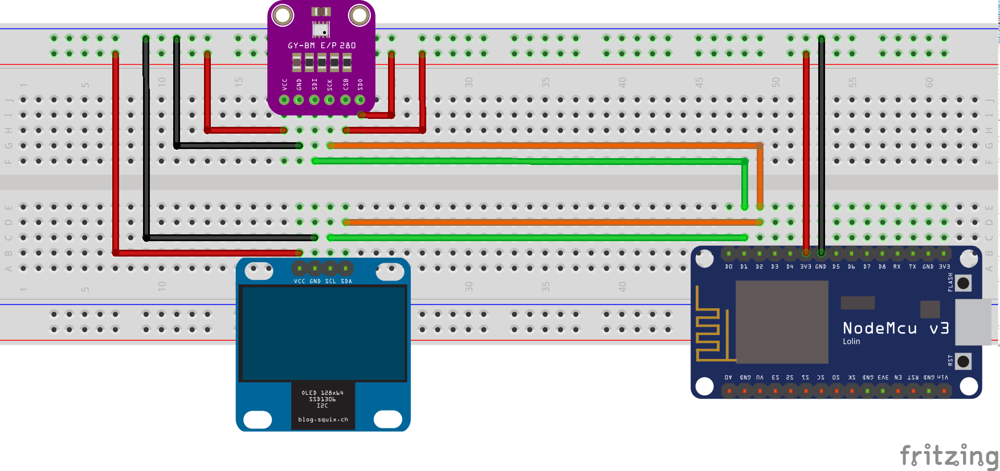

# ESP8266 based Weather Station

What it does:
* Show current temperature and humidity
* Publish temperature and humidity data to a MQTT Broker

Parts used:

* NodeMCU v3
* Bosch GY-BM E/P 280
* SSD1306 - 0.96" OLED Display

Wiring:

